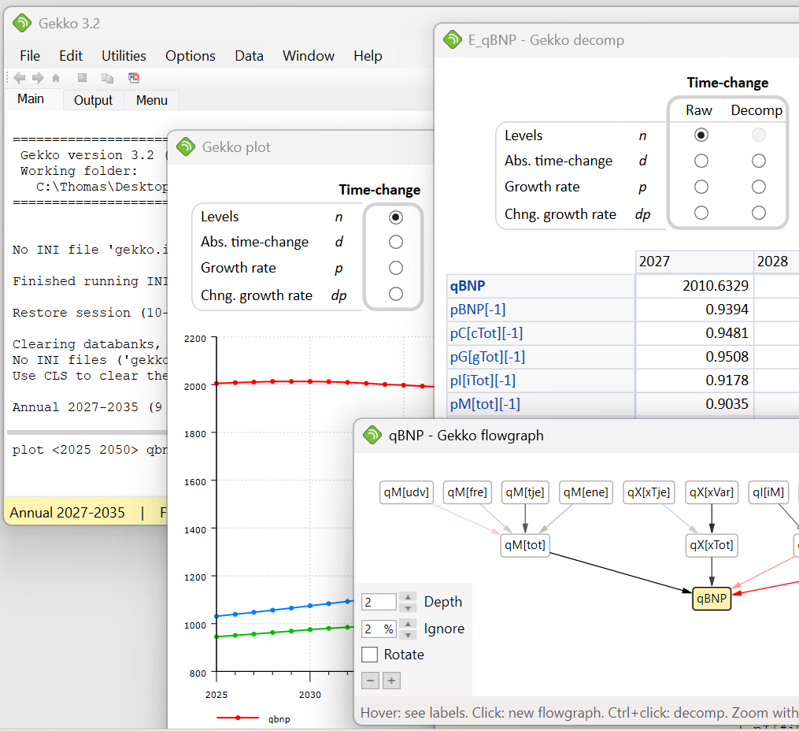

# Gekko Timeseries And Modeling Software
Gekko is for timeseries handling, and solving of large-scale economic models.

Gekko is an open-source time-series oriented software package for handling and analyzing timeseries data, and for solving and analyzing large-scale economic models. Since 2009, Gekko is being used by Danish ministeries, banks, interest groups and universities, for the simulation of economic and energy-related models. It is also used to show and analyze GAMS models. The software runs under Windows (.NET), and is licenced under GNU GPL.

Some features:
* Timeseries-oriented software, with flexible databanks. Suitable data handling/wrangling and modeling, etc.
* Timeseries can be dimensional (so-called array-timeseries). Data-tracing remembers how timeseries are constructed (data lineage).
* Annual, quarters, months, weeks, days and undated frequencies supported. Conversions between these + seasonal correction.
* Other variable types like values, dates, strings, lists, maps and matrices, including many functions dealing with these.
* Dynamically loaded and compiled models, including failsafe mode.
* Gauss and Newton solvers, with ordering and feedback logic. Fair-Taylor or Newton-Fair-Taylor solver for forward-looking models. Any number of simultaneous goals/means possible.
* In-built equation browser, with integrated variable list.
* Decomposition of model equations (including GAMS models), showing contributions. Flowgraphs to show this info, too.
* User-defined functions and procedures, can be stored in libraries.
* Graphics by means of embedded gnuplot
* Interface to Python, R, GAMS and others. Reads/writes file formats like xls, xlsx, prn, csv, tsd, gdx, px, arrow-files. Integrated add-in for Excel.
* Tabelling and menu system, outputting in text, html or Excel
* Open databank format, using (Google) protocol buffers for storage.
* Strict and consistent language syntax (via in-built ANTLR parser), with loops, conditionals etc.
* Used by Statistics Denmark, Ministry of Finance, Ministry for Economic Affairs, Danish Economic Councils, the central bank of Denmark, institutions, universities and more.
* Easy installation by means of a all-inclusive Windows installer, or manually by means of a zip-file with gekko.exe etc.
* Open source. No licenses to compilers etc. -- everything used is C#/.NET (+ gnuplot and x12a). So everything is open-source, and therefore free of charge.

## More Gekko info:
* [Gekko main homepage](http://www.t-t.dk/gekko)
* [New features (3.2)](http://t-t.dk/gekko/docs/user-manual/index.html?i_new_features.htm)
* [Releases on GitHub](https://github.com/thomsen67/GekkoTimeseries/releases)

## Contributing + source code
* You may fork and clone the source code from here, or simply download it as a zip file. You may consider working a stable [release](https://github.com/thomsen67/GekkoTimeseries/releases).
* [Source code documentation](http://t-t.dk/gekko/source-code-doc)
* Advice on running the code in Visual Studion 2017 (or later): open the solution file (GekkoCS.sln) with Visual Studio. Make sure that the solution configuration is set to "Debug" and the solution platform is set to "Any CPU". Also make sure that the Gekko project is chosen as "StartUp Project". Next, it should be possible to start the Gekko application under Visual Studio by simply pressing F5. If you change the ANTLR .g syntax definition files, use the .bat files to transform to C# (this demands Java and ANTLR 3.1.3).
* Please note that the software is open source (GNU GPL). That is, it is free of charge, but the source code cannot be used in commercial applications. The source code can only be used and modified in other open source projects.

